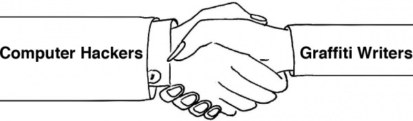

# About

**000000book** ("blackbook") is an open repository for sharing and archiving motion captured graffiti tags. Tags are saved as digital text files known as GML (Graffiti Markup Language), which can be captured through freely available software such as [Graffiti Analysis](http://graffitianalysis.com/downloads/) (marker), [DustTag](http://graffitianalysis.com/iphone/) (iPhone), [EyeWriter](http://eyewriter.org) (eye capture), [Laser Tag](http://graffitiresearchlab.com/?page_id=76) (laser).

Graffiti writers are invited to capture and share their own tags, and computer programmers are invited to create new applications and visualizations of the resulting data. The project aims to bring together two seemingly disparate communities that share an interest hacking systems, whether found in code or in the city.

→ Watch: [000000book Intro Video](http://vimeo.com/8072358)

## API

- [Downloading GML](docs/api/downloading-gml.md)
- [Uploading GML](docs/api/uploading-gml.md)
- [Rendering GML](docs/gml/playback-implementations.md), across C++, Processing, Javascript, Flash, PHP and Python

Full documentation is in [docs/](docs/README.md), imported from the GitHub wiki
and served on the site at [/docs](https://000000book.com/docs). `/api` redirects
to the API section, and [/llms.txt](https://000000book.com/llms.txt) indexes it
all for crawlers.

## Team

The GML and **#000000book** development team consists of [Jamie Wilkinson](http://jamiedubs.com),
[Evan Roth](http://evan-roth.com), [Theodore Watson](http://www.theowatson.com),
[Chris Sugrue](http://csugrue.com/) and [Todd Vanderlin](http://toddvanderlin.com/),
all members of the copyleft [F.A.T. Lab](http://fffff.at).

Additional Flash development assistance from [Manolis Perrakis](http://art.manorius.com/)

Contact us: _info[at]000000book.com_

Code available under an MIT License

Copyfree 2009-2023 F.A.T.<br />
"Release early, often & w/ rap music"


---

# Development Setup (Rails 8)

This application has been updated to **Rails 8.1.3.1** and **Ruby 3.4.5** for modern compatibility.

## Prerequisites

- **Ruby 3.4+** (see `.ruby-version`)
- **Rails 8.1+**
- **MySQL 8.4** (see `compose.yaml`)
- **Bundler 2.0+**
- **Docker**, for the pinned MySQL and the migration rehearsal

Assets are served by Propshaft, so there is no Node.js or yarn build step.

The app runs natively rather than in a container, which is faster on macOS.
Only MySQL is containerized, pinned in `compose.yaml` to the version the server
runs. CI pins the same version. Testing against a different major version is
what let the utf8mb3 and MyISAM problems sit unnoticed.

## Getting Started

### 1. Clone and Install Dependencies

```bash
git clone [repository-url]
cd blackbook
bundle install
```

### 2. Database Setup

```bash
# Starts the pinned MySQL 8.4, then creates and migrates both databases
docker compose up -d
bin/rails db:prepare
```

Development, test and CI all use that MySQL, so they match the server. Set
`MYSQL_PORT` to point at a different one.

### 3. Credentials Configuration

This app uses Rails encrypted credentials (Rails 7 standard):

```bash
# View current credentials
bin/rails credentials:show

# Edit credentials (opens in $EDITOR)
bin/rails credentials:edit
```

**Important**: The `config/master.key` is auto-generated and should never be committed to git.

#### Current Credentials Structure
```yaml
# Available in credentials:
secret_key_base: [automatically generated]
```

#### Environment Variables
`.env.example` covers the production scripts only. For local work, `MYSQL_PORT`
and `MYSQL_PASSWORD` override `config/database.yml`, which defaults to the
MySQL in `compose.yaml`.

### 4. Start the Application

```bash
# Development server
bin/rails server

# Visit: http://localhost:3000
```

## Testing Migrations

The test database is built from `schema.rb`, so it has never looked like
production, which is still MyISAM and utf8mb3. Migrations that pass the suite
can still fail or corrupt data there.

```bash
./script/rehearse-migrations.sh
```

This pulls production's table definitions (schema only, never any rows), loads
them into a throwaway MySQL 8.4 database, seeds the duplicate users that decide
which branch `AddMissingUniqueIndexes` takes, and runs every pending migration.
Run it before applying migrations to a real server.

## Data Storage

The application stores data in two places:

1. **Database**: `users`, `tags`, `visualizations`, `favorites`, `likes` and `notifications`
2. **GML Files**: one file per tag under `data/`, named `{tag_id}.gml`, read and
   written by `GmlObject`

## Useful Rake Tasks

### GML Data Management
```bash
# Save all GmlObjects to disk
bin/rails gml_objects:save_to_disk


# Fix missing GmlObjects
bin/rails gml_objects:fix_missing
```

### Data Validation
```bash
# Read-only audit: missing GML files, orphan files, broken images, orphaned rows,
# and duplicates that would abort a pending unique-index migration.
# Exits non-zero on blockers, so it works as a deploy preflight.
bin/rails data:validate
```

### Data Cleanup
```bash
# Find tags with missing data
bin/rails tags:find_missing_data
```

`tags:delete_missing_data` permanently destroys tags and requires
`CONFIRM_DELETE=yes-i-have-a-backup`. It reads "missing" from disk, so an
unmounted `data/` makes every tag look empty. Run `data:validate` first.

## Deployment

Beta deploys as a container via Kamal. See [docs/deployment.md](docs/deployment.md).

```bash
kamal deploy      # build, push, roll over with no downtime
kamal rollback    # back to the previous image
kamal migrate     # migrations, deliberately never automatic
```

### The older path, still in use for production

`./deploy` ships code to the production server. It reads `PROD_HOST`, `PROD_USER` and `PROD_APP_PATH` from `.env`. It retires once Kamal serves production.

```bash
./deploy              # deploy origin/main
./deploy <git-ref>    # deploy a specific branch, tag or SHA
```

It stops before changing anything if the server has uncommitted work, if the GML volume is not mounted, if `secret_key_base` is unavailable, or if the target needs a Ruby version rbenv does not have. After restarting it confirms the service is up and the site returns 200, then prints the previous SHA so you can roll back with `./deploy <sha>`.

It does not run migrations. The pending set drops the `comments` table, so migrating is a separate deliberate command. Run `rake data:validate` first. `./deploy` reports what is pending and stops there.

### Auditing production

```bash
script/audit-production.sh    # read-only: what is deployed, what pending migrations will hit
script/backup-production.sh   # verified dump, GML corpus, images, gitignored config
script/resync-beta.sh         # reload beta from live production data
```

More in [docs/operations.md](docs/operations.md).

## Migration Notes

This app was upgraded from Rails 4.2 to Rails 8.1. Major changes include:

- **Credentials**: Moved from `config/secrets.yml` to encrypted `config/credentials.yml.enc`
- **Strong Parameters**: the three mass-assignment sites (tags, users, password reset) use `params.expect`
- **Modern Validations**: Updated from `validates_presence_of` to `validates` syntax
- **Asset Pipeline**: Sprockets replaced by Propshaft. Propshaft does not read `//= require`
  directives, so scripts are listed explicitly in `layouts/_template_header.html.haml`.
- **Auth**: Authlogic replaced by `has_secure_password`. Pre-existing scrypt
  hashes are verified against the old scheme and rehashed to bcrypt on next
  login, so nobody is locked out
- **Uploads**: kt-paperclip replaced by Active Storage, with variants matching
  the old Paperclip geometry
- **Database**: MyISAM to InnoDB and utf8mb3 to utf8mb4. Development, test and CI
  now all run the MySQL 8.4 in `compose.yaml`

## Development Notes

- **Console**: `kamal console`, or `kamal app exec --reuse "bin/rails runner 'code'"`
- **Asset Compilation**: `bin/rails assets:precompile` for production
- **Background Jobs**: None currently configured
- **File Uploads**: Active Storage, stored on local disk. There is no S3

## Troubleshooting

### Common Issues

**Missing Master Key**
```bash
# If you get "Rails.application.credentials is missing" error:
# The master key should be in config/master.key (gitignored)
# For production, set RAILS_MASTER_KEY environment variable
```

**Database Connection**
```bash
# config/database.yml is checked in. It defaults to the MySQL in compose.yaml;
# MYSQL_PORT and MYSQL_PASSWORD override it, and production reads DATABASE_URL.
docker compose up -d
bin/rails db:prepare
```

**Asset Issues**
```bash
# Clear and recompile assets
bin/rails assets:clobber
bin/rails assets:precompile
```

**GML Data Directory**
```bash
# Create data directory if missing
mkdir -p data
# Check permissions
chmod 755 data
```

