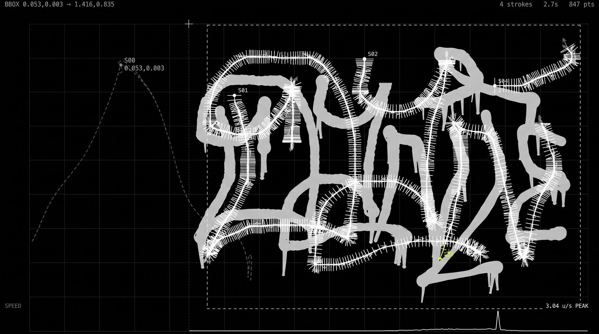

# 000000book

An open archive of motion-captured graffiti, running since 2009. Every tag is a
[GML](http://fffff.at/gml-week-graffiti-markup-language/) file: the writer's
hand as coordinates and timestamps, replayable by anyone. Writers capture and
share tags; programmers build things that read them. Live at
[000000book.com](https://000000book.com).

Rails 8.1 on Ruby 3.4, MySQL 8.4, deployed as a container by Kamal. No Node
build step: assets go through Propshaft and the player is plain ES modules.

## Run it

```bash
docker compose up -d      # MySQL 8.4, the version the server runs
bundle install
bin/rails db:prepare
bin/rails db:seed         # development only: real app names on the test tags
bin/rails server          # http://localhost:3000
bundle exec rspec         # no environment variables needed
```

`MYSQL_PORT` and `MYSQL_PASSWORD` override `config/database.yml`.

## What is where

- `public/canvasplayer/<version>/` is [canvasplayer](https://github.com/jamiew/canvasplayer),
  byte for byte. `SOURCE` there says how to update. It lives outside the asset
  pipeline because Propshaft's fingerprints would break the modules' relative
  imports.
- `app/assets/javascripts/player.js`, `gml_thumbnails.js` and `recorder.js` are
  the only player code that belongs here: the tag page, the live grid cells,
  and the recorder on `/upload`.
- `data/<id>.gml` is each tag's file, read and written by `GmlObject`. Images
  are Active Storage on local disk.
- `docs/` is the API and GML documentation, served at
  [/docs](https://000000book.com/docs) and indexed by
  [/llms.txt](https://000000book.com/llms.txt). `/api` redirects there and
  `/openapi.yaml` is the machine-readable version.

## Pages

- `/` and `/data` play one tag beside the grid. Click a cell, press ← →, or
  let it run on like a slideshow. The front page keeps quiet: no labels, just
  the tags and the player's readout.
- `/data/:id` is one tag with a filmstrip of its neighbours. Controls opens the
  pane: looks, live or still, ink mode, effects, data layers.
- `/apps` plays the newest tag made with each app. `/upload` explains how to
  make a tag and lets you draw one.

## API

- `GET /data/:id.gml`, `.json` or `.xml`. `?preview=1` is about 300 points for
  thumbnails; `?player=1` is the full-fidelity payload the site plays.
- `POST /data` with `gml=` uploads. Details in [docs/api](docs/api/README.md).

## Migrations and data

```bash
./script/rehearse-migrations.sh   # pending migrations against production's real schema
bin/rails data:validate           # read-only audit; exits non-zero on blockers
bin/rails gml_objects:save_to_disk
bin/rails gml_objects:fix_missing
bin/rails tags:find_missing_data
```

The test database is built from `schema.rb` and has never looked like
production, which is still MyISAM and utf8mb3, so rehearse before any deploy.
Migrations never run on deploy; the pending set drops the `comments` table.
`tags:delete_missing_data` destroys rows and needs
`CONFIRM_DELETE=yes-i-have-a-backup`.

## Deploy

```bash
kamal deploy                    # beta: build, push, roll over
kamal rollback
kamal migrate                   # deliberate, never automatic
./deploy [git-ref]              # production, until Kamal serves it
script/audit-production.sh      # read-only
script/backup-production.sh
script/resync-beta.sh
```

[docs/deployment.md](docs/deployment.md) and [docs/operations.md](docs/operations.md)
have the detail.

## Team

[Jamie Wilkinson](http://jamiedubs.com), [Evan Roth](http://evan-roth.com),
[Theodore Watson](http://www.theowatson.com), [Chris Sugrue](http://csugrue.com/)
and [Todd Vanderlin](http://toddvanderlin.com/) of the copyleft
[F.A.T. Lab](http://fffff.at), with Flash help from
[Manolis Perrakis](http://art.manorius.com/). Contact info[at]000000book.com.
MIT licensed. Copyfree 2009 onward. "Release early, often & w/ rap music."
